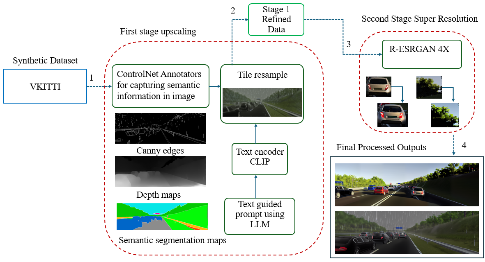

# Enhancing-Synthetic-Image-Realism
This work focuses on improving the visual fidelity of synthetic images using controlled diffusion models, guided text prompts, and super-resolution techniques. Our approach aims to generate high-quality, realistic samples suitable for downstream tasks in computer vision and generative AI. Includes a modular pipeline with ControlNet integration and optimization strategies for faster processing.

## 🔧 Pipeline Overview

The following block diagram illustrates the core components of our pipeline:

**Pipeline Stages:**
- **Input**: Synthetic image or segmentation map  
- **ControlNet**: Edge, Depth, and Segmentation map along with Text-prompt guided image refinement  
- **Super-Resolution**: Second step for upscaling and photorealistic enhancement  
- **Output**: High-resolution, realistic image 
