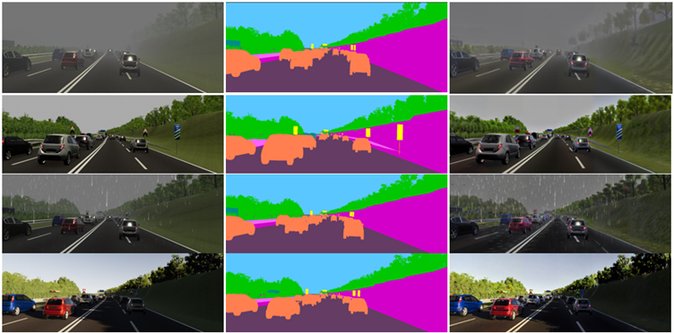
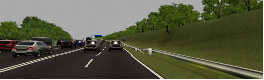
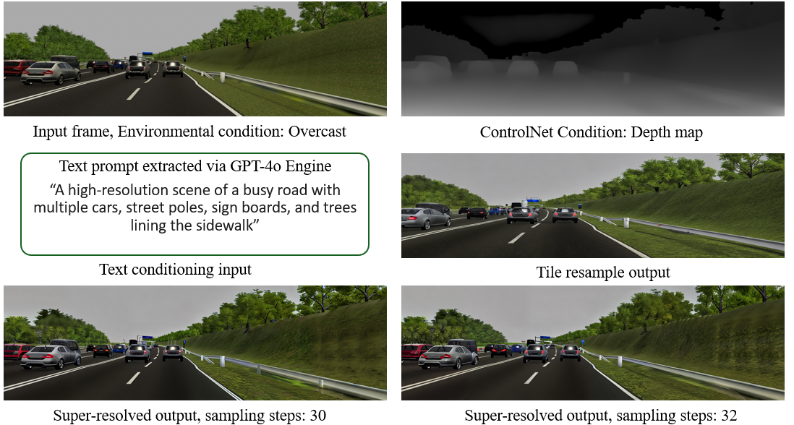
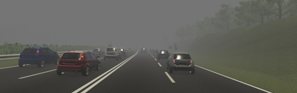
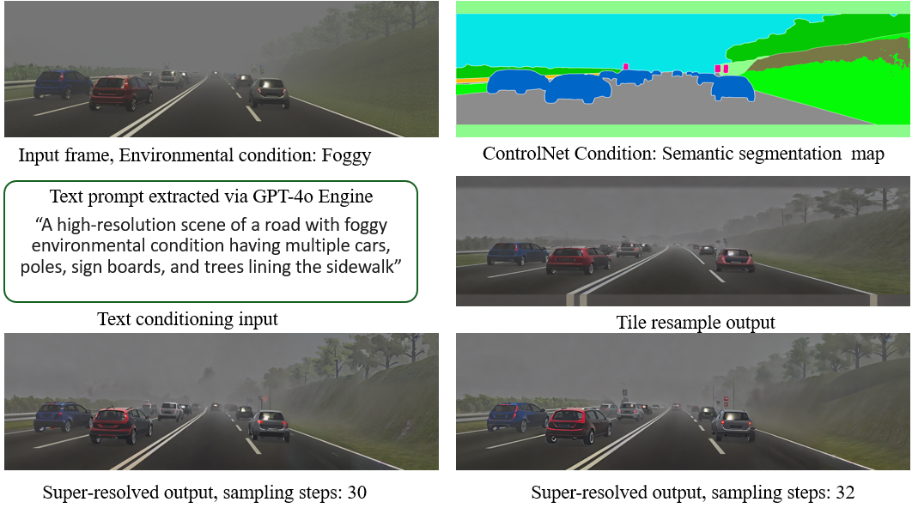

# Enhancing-Synthetic-Image-Realism
This work focuses on improving the visual fidelity of synthetic images using controlled diffusion models, guided text prompts, and super-resolution techniques. Our approach aims to generate high-quality, realistic samples suitable for downstream tasks in computer vision and generative AI. Includes a modular pipeline with ControlNet integration and optimization strategies for faster processing.

## 🔧 Pipeline Overview

The following block diagram illustrates the core components of our pipeline:

**Pipeline Stages:**
- **Input**: Synthetic image or segmentation map  
- **ControlNet**: Edge, Depth, and Segmentation map along with Text-prompt guided image refinement  
- **Super-Resolution**: Second step for upscaling and photorealistic enhancement  
- **Output**: High-resolution, realistic image

- ## 🧪 Results Demonstration

Below are sample outputs comparing the original synthetic images with their enhanced versions:

| Input | Enhanced Output |
|-------|-----------------|
|  |  |
|  |  |

Further we have also uploaded high resolution refined image results for each of the weather conditions from VKITTI dataset to drive for viewing purposes. 
🔗 **[Click here to view more results](https://drive.google.com/drive/folders/1137cEULEMRXd-SP0AJgXaJhO-nSb4cAw?usp=sharing)**

## 🔗 ControlNet Models

Download or explore the ControlNet models used in this project:

- [ControlNet Github Page](https://github.com/lllyasviel/ControlNet)
- [ControlNet for Canny Edges](https://huggingface.co/lllyasviel/ControlNet)
- [ControlNet for Depth Maps](https://huggingface.co/lllyasviel/ControlNet-depth)
- [Custom Trained ControlNet (Coming Soon)](link_to_custom_model)

  

